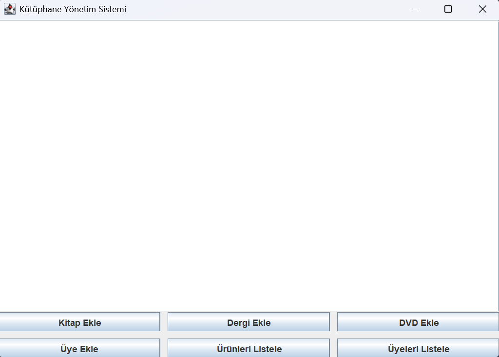
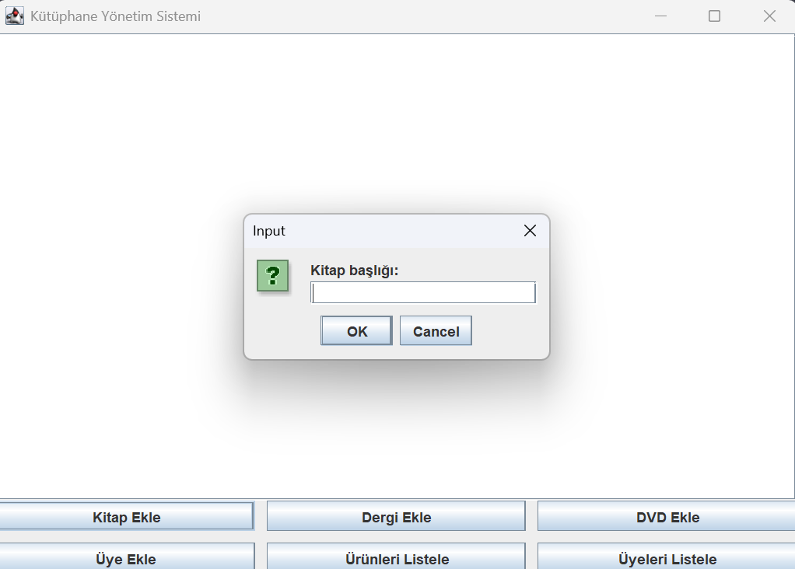

# 📚 Library Management System (v2)



Java ile geliştirilmiş, veritabanı destekli kütüphane yönetim sistemi.

---

## 🚀 Features

### 📦 Ürün Yönetimi

* Kitap, DVD ve Dergi ekleme
* Ürünleri detaylı listeleme
* Ürün durumunu görüntüleme (Müsait / Ödünçte)

### 👤 Üye Yönetimi

* Üye ekleme
* Üyeleri listeleme

### 🔄 Ödünç Sistemi

* Ürün ödünç verme
* Ürün iade alma
* Aynı ürünün birden fazla kişiye verilmesini engelleme
* Aktif ödünçleri görüntüleme

### 🖥️ Arayüz

* Console menu (App)
* Swing GUI

---

## 🧠 Concepts Used

* Object-Oriented Programming (OOP)

  * Inheritance
  * Encapsulation
  * Polymorphism
* DAO Pattern
* JDBC
* SQL (MySQL)
* Layered Architecture

---

## 🏗️ Project Structure

```
src
 ├── app        → Console uygulaması
 ├── ui         → Swing GUI
 ├── model      → Veri modelleri
 ├── service    → İş mantığı
 ├── dao        → Veritabanı işlemleri
 └── util       → Database bağlantısı
```

---

## 🗄️ Database Setup

Tüm tabloları oluşturmak için:

👉 `database.sql` dosyasını çalıştırın

MySQL Workbench üzerinden:

1. Yeni query aç
2. `database.sql` içeriğini yapıştır
3. Run

---

## ▶️ How to Run

1. MySQL’de database oluştur:

```sql
CREATE DATABASE library;
```

2. `database.sql` dosyasını çalıştır

3. `DatabaseConnection` içinde:

```java
URL, USER, PASSWORD
```

bilgilerini kendine göre düzenle

4. Uygulamayı çalıştır:

### Console:

```
src/app/App.java
```

### GUI:

```
src/ui/LibraryGUI.java
```

---

## 🛠️ Technologies

* Java
* MySQL
* JDBC
* Swing
* IntelliJ IDEA

---

## 📈 Future Improvements

* JavaFX ile modern GUI
* Arama / filtreleme sistemi
* Kullanıcı giriş sistemi
* Ödünç geçmişi ekranı
* REST API (Spring Boot)

---

## ⚠️ Important

Database bağlantısı için:

```java
DatabaseConnection.java
```

dosyasındaki USER ve PASSWORD bilgilerini kendi sisteminize göre düzenleyin.

---

## 👨‍💻 Author

Developed as part of learning:

* Java
* OOP
* Database Integration
* Software Design

---

## 🔗 Repository

https://github.com/Modart00/library-management-system

## 🖥️ GUI

### Ana Ekran


### Ürün Ekleme


